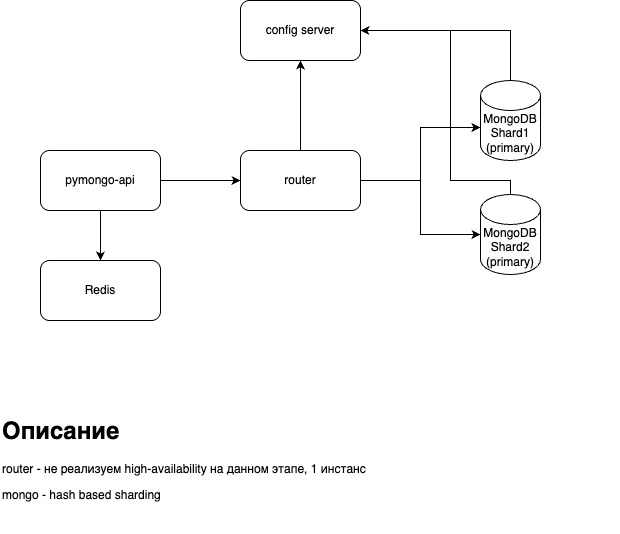
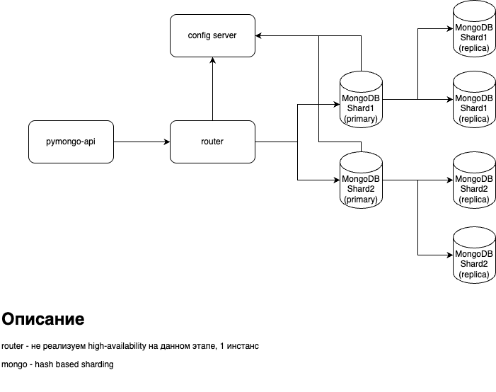
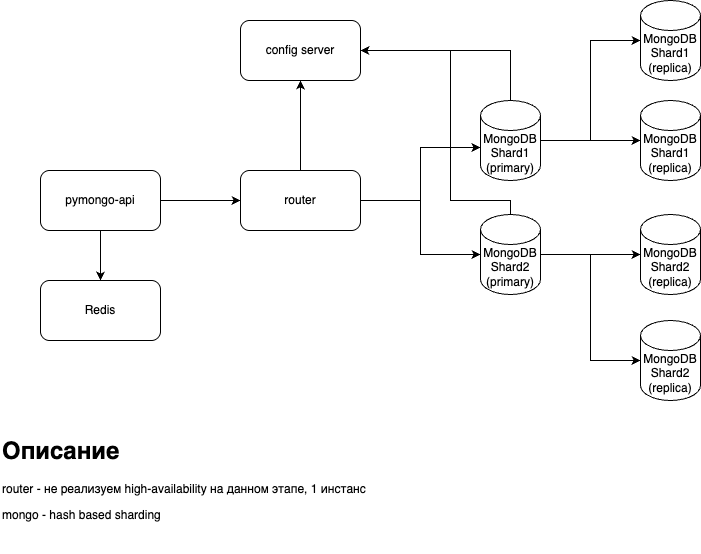
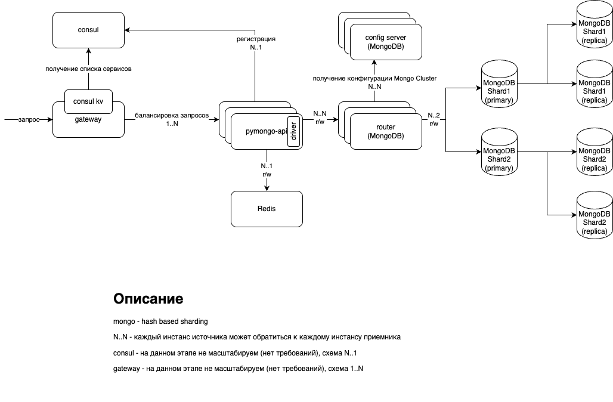
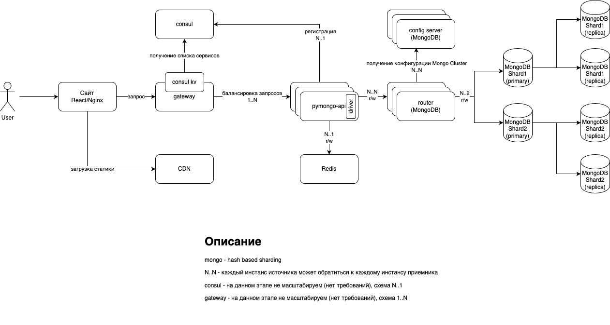

# pymongo-api

## Как запустить
Переходим в директорию [mongo-sharding-repl](mongo-sharding-repl)
```shell
cd ./sharding-repl-cache
```

Запускаем mongodb и приложение по инструкции в [README.md](mongo-sharding-repl/README.md)


Файлы диаграмм тестового приложения:

[task2_hw.drawio](task2_hw.drawio)


[task3_hw.drawio](task3_hw.drawio)


[task4_hw.drawio](task4_hw.drawio)


[task5_hw.drawio](task5_hw.drawio)


[task6_hw.drawio](task6_hw.drawio)


